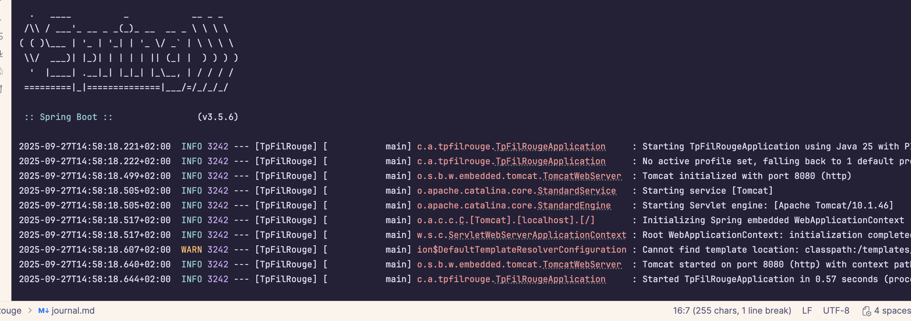
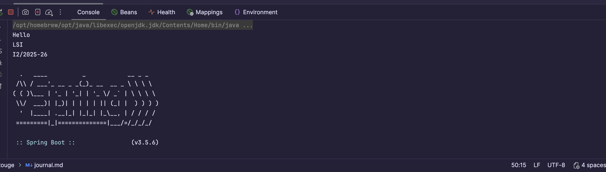
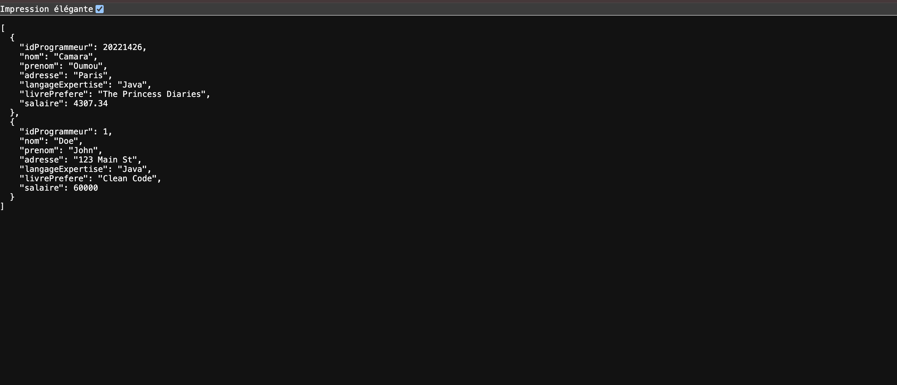

<h1 align="center"> Journal de bord TP Fil Rouge </h1>

<p align="center"> ────────୨ৎ──────── </p>

### Partie 1 (1-2):
#### 1. Lorsque vous cliquez sur le bouton vert pour lancer l'application, quelles sont les étapes ducycle de vie de l’application (ALM) exécutées par votre IDE ?

Les étapes exécuté par mon IDE sont :

1. **Compilation du code** : Maven compile le code Java en fichiers `.class`. Les fichiers compilés sont placés dans le dossier `target/classes`.
2. **Vérification des dépendances** : Maven vérifie que toutes les dépendances sont disponibles, sinon il les télécharge.
3. **Démarrage de Spring Boot** : Spring Boot initialise l'application, vérifie les profiles actifs et configure l'environnement.
4. **Démarrage du serveur web Tomcat** : Tomcat embarqué est initialisé et prêt à écouter sur le port configuré (8080 par défaut).
5. **Chargement des beans** : Spring crée et injecte tous les beans nécessaires.
6. **Application prête** : L'application est prête à recevoir des requêtes.





**ligne 1**: Spring Boot démarre l’appli avec Java 25 à partir des classes compilées.

**ligne 2**: Le profile par default est utilisé car aucun autre n'est defini (à definir dans application.properties/application.yml).

**ligne 3**: Tomcat(le serveur embarqué) s'est initialisé sur le port 8080 et est pret a écouté.(pour changer le port si il est deja occupé, il faut le modifier dans application.properties).

**ligne 4**: Le serveur Tomcat demarrre.

**ligne 5**: le moteur Servlet (la partie qui exécute les servlets/JSP) démarre ; version de Tomcat affichée (10.1.46).

**ligne 6**: Tomcat "demande" à Spring d’initialiser le WebApplicationContext embarqué. Spring crée le contexte spécifique au web (scanne contrôleurse etc).

**ligne 8**: WARN avertissement Spring/Thymleaf ne trouve pas le dossier classpath:/templates/, le dossier qui doit contenir les fichiers .html pour le front.

**ligne 9**: Tomcat a démarrrer complètement et ecoute sur le port 8080 avec comme contexte paths "/" la racine. L'application est maintenant accessible sur http://localhost:8080/

**ligne 10**: spring boot confirme que tout a démarré correctement et que l'application est prete à recevoir des requetes, on a aussi , le temps que ça a prit depuis le lancement du processur à maintenant.


```
@SpringBootApplication
public class TpFilRougeApplication {
public static void main(String[] args) {
SpringApplication.run(TpFilRougeApplication.class, args);}}
```
##### 1.14. Quel est le rôle de chacune des instructions surlignées ci-dessus ?
- @SpringBootApplication est l'annotation principale de SpringBoot; elle inclut @SpringBootConfiguration @EnableAutoConfiguration et @ComponentScan.
@SpringBootConfiguration indique qe cette classe est la classe principale de Spring Boot pour la configuration.
@EnableAutoConfiguration va permettre d'activer la configuration automatique selon les dependances intallées sur le projet.
@ComponentScan qui va scanner les packages pour détecter les beans annotés/ les composants comme @Component, @Service, @Repository et @Controller.
 
Pour résumer @SpringBootApplication indique à Spring Boot que c’est la classe principale, qu’il doit configurer automatiquement l’application et scanner les composants dans le projet.

- SpringApplication.run(TpFilRougeApplication.class, args); démarre l’application Spring Boot : il crée le contexte Spring, initialise tous les beans et lance le serveur web embarqué.


Après chaque modification du code, pensez à redémarrer le serveur ! Sinon les modifications ne seront
pas visibles.
1.15. Selon vous, pourquoi est-il nécessaire de faire cela ?

Car tant que ne redemarre pas le serveur les nouvelles classes, les modifications du code ne seront pas prise en compte.

### 2. GET1
#### 2.1. Dans le point d’entrée, en utilisant une instance de List, ajoutez des instructions pour afficher
   ```
   Hello
   LSI
   I2/2025-26
   ```
   #### Selon vous, peut-on garder ce code dans le point d’entrée ? Quels sont les risques ? ####
Non, ce n’est pas recommandé, concernant les risques:
- Premièrement c'est une violation des pronnes pratiques Spring qui consiste a gerer le code via des beans.
- Le code sera difficile à maintenir par la suite et peut causer des erreurs au démarrage. 
- Les codes dans la fonction main sont difficilement testable par les tests unitaires ou d'intégration.





#### 2.2.3. Nous voulons qu'afficherHello() soit appelée lorsque nous lançons l'application via le navigateur. Comment faire (indice : annotations)? Et que se passe-t-il "sous le capot" lorsque vous utilisez ces annotations ? 

Pour appelé affciherHello() il faut utiliser les annotations : 
- @RestController pour indiquer que la classe reponds aux requetes
- @GetMapping("/hello") pour dire que quand on appel le endpoint http//:localhost:8080/hello avec une requete GET alors la méthode afficherHello() est exécutée et le resultat s'affiche dans un json.
Quand on utilise ces annotations Spring Boot démarre et scanne les classes. Il détecte les classes marquées @RestController et enregistre les methodes marquées avec  @GetMapping comme des endpoints. 


#### 2.3. Créez un package modele.
##### 2.3.1. Dans ce package créez la classe Programmeur ayant les attributs suivants :
````
idProgrammeur (Integer), nom (String), prenom (String), adresse
(String), langageExpertise (String), livrePrefere (String), salaire
(Double).
````
#### 2.3.2. Dans Programmeur.java, générez :
• Des getters et setters
• 1 constructeur avec tous les attributs en paramètres
• Un override de toString()

#### Version avec Lombok : 
L'annotation @Data : contient @Getter, @Setter et  @ToString mais aussi @EqualsAndHashCode et @RequiredArgsConstructor.
- @EqualsAndHashCode : 
  - equals() compare deux objets par contenu.
  - hashCode() génère un nombre entier (un code de hachage) à partir de sa valeur, ça sert pour la comparaison d'objet  par exemple si on compare deux objets avec equals () et qu'ils ont les memes attibuts, leurs hashcodes générés sera identique. Ca sert aussi a ranger ou chercher rapidement un objet dans une collection comme un HashSet ou une HashMap.

- @RequiredArgsConstructor : 
Cette annotation va générer un construteur avec les champs final ou @NonNull, donc pas forcément tous les champs donc @AllArgsConstructor est plus complet.

#### 2. Affichez deux instances de Programmeur :
#### 2.1. Sur la console :


#### 2.2. Sur une page Web:


<p align="center"> ────────୨ৎ──────── </p>

### Partie 2 (3-4):
#### 3.1.2. Configuration de la source de données
##### 3.1.3. pom.xml
#### Selon vous, que se passe-t-il lorsqu'on active cette dépendance ?

Spring Boot active JPA et Hibernate automatiquement, ce qui permet :
 - de mapper tes classes @Entity avec les tables de ta base,
 - d’exécuter des requêtes sans écrire de SQL grâce aux JpaRepository,
 - de créer ou mettre à jour les tables automatiquement,
 - de gérer les transactions pour nous.

**JDBC** (Java Database Connectivity), c’est l’API de base de Java pour communiquer avec une base de données.

**Data source** configuration de la connexion à la base de données.
Elle contient :
 - l’URL JDBC (jdbc:mariadb://localhost:3306/Base_ALTN72),
 - le nom d’utilisateur et le mot de passe,
 - le driver JDBC (fichier )
 - 
#### 3.2. CODE DE LA COUCHE "M"

**Entity** est une classe java mappée à une base de donnée. Les instances correspondes aux lignes et les attributs à chaque colonne.

#### 4. Stack "C" : évolution
#### 4.1. Affichage des Programmeurs
#### 4.1.1. Comment pouvons-nous appeler la méthode de ProgrammeurRepository qui nous
   permettra de récupérer les infos sur les programmeurs ?`
On appelle la méthode prédéfinie findAll() en utilisant l’instance du ProgrammeurRepository injectée dans la couche Service. Cette méthode renvoie la liste complète des programmeurs présents dans la base de données.
#### 4.1.2. Pouvons-nous le faire directement dans la classe ProgrammeurControleur ?
Ce n’est pas recommandé, car cela viole le principe de séparation des responsabilités. Le contrôleur doit uniquement gérer les requêtes HTTP et les réponses, tandis que la logique métier (comme l’appel à la base via le repository) doit être gérée par la couche Service.
#### 4.1.4. Quel est, selon vous, l'intérêt d'utiliser l'annotation @Service ?
L’annotation @Service indique à Spring que la classe contient la logique métier de l’application. Elle permet :
	- à Spring de détecter et d’instancier automatiquement la classe comme un bean,
	- de séparer la logique métier du contrôleur pour améliorer la lisibilité, la modularité et la maintenabilité du code,
	- de faciliter l’injection de dépendances dans d’autres composants comme les contrôleurs.

4.1.7. Où en sommes-nous par rapport au diagramme d'architecture multi stack ?
À ce stade, On est a 3 couches sur 4 de l’architecture multi-stack :
- Persistance : grâce à JPA/Hibernate et MariaDB, nous accédons et manipulons les données stockées en base.
- Service : via la classe ProgrammeurService, nous gérons la logique métier et faisons le lien entre la persistance et l’API.
- API / Contrôleur : avec ProgrammeurControleur, nous exposons des endpoints REST (GET, POST, PUT, PATCH, DELETE) accessibles via HTTP.

La seule couche manquante pour compléter complètement le schéma est la Vue (avec Thymeleaf ou autre moteur de rendu), qui permettra de présenter les données à l’utilisateur final côté client.

#### 4.4. Modification d'un programmeur (PUT ou PATCH)
Créez une méthode qui permet de modifier un programmeur à partir de son id. Quelle est la
différence entre PUT et PATCH ?

La différence est que Put écrase toutes les données au moment de la modification alors que Patch modifie uniquement les infos données dans la requete.
- PUT : remplace toutes les données de la ressource. Même les champs non mentionnés dans la requête sont réécrasés (souvent mis à null s’ils ne sont pas fournis).
- PATCH : modifie uniquement les champs présents dans la requête. Les autres attributs restent inchangés.
